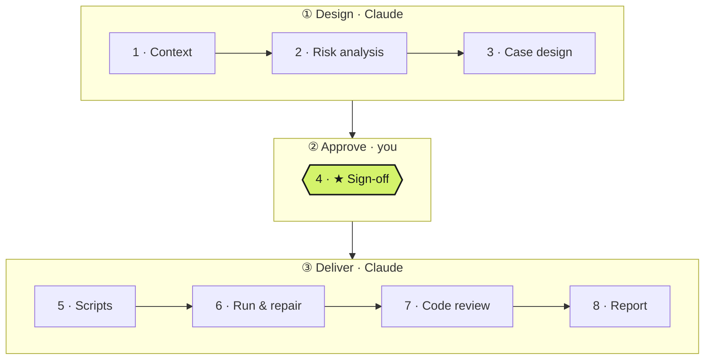
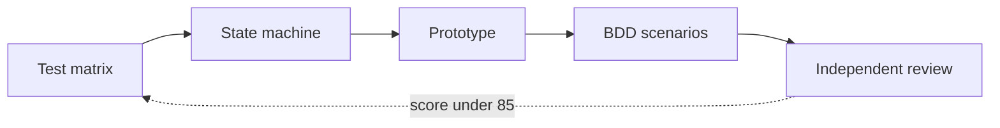

# qa-workflow

English | [繁體中文](README.zh-TW.md)

**Hand Claude a feature. Approve the scenarios. Get a release verdict.**

`qa-workflow` is a Claude Code plugin that does the QA legwork for a feature. It reads the change, works out what could break, writes BDD scenarios, turns them into automated tests, and tells you whether the feature is ready to ship.

## Install

Pick one:

**Claude Code plugin** (recommended)
```
/plugin marketplace add JulianWangHZ/QA-Workflow-Skills
/plugin install qa-workflow@qa-workflow
```

**npx**: installs the skills into any agent that reads `SKILL.md`
```bash
npx -y skills add JulianWangHZ/QA-Workflow-Skills --skill '*' -g
```

**git clone**: for offline use or local changes
```bash
git clone https://github.com/JulianWangHZ/QA-Workflow-Skills.git
```
Then, in Claude Code, run `/plugin marketplace add ./QA-Workflow-Skills` followed by `/plugin install qa-workflow@qa-workflow`.

Install all eight skills together. They share the CLI in `skills/qa-workflow`.

## Quick start

In the project you want to test, tell Claude what to check:

```
QA this ticket: https://your-tracker/browse/SHOP-128
QA the checkout flow on branch feature/checkout
QA the new password-lockout rule: 5 wrong attempts lock the account for 15 minutes
```

It only stops when it needs you:

| When | What you do |
|---|---|
| First run | Confirm the test commands it detected (`.qa/config.json`) |
| A required MCP server or device is missing | Set it up, restart Claude Code, then say *continue QA* |
| **★ Sign-off** | Open the review page, then approve the scenarios or ask for changes |

Everything else runs on its own. The report ends up in `.qa/reports/latest.html`.

| Later, to… | Say |
|---|---|
| Resume an interrupted run | *continue QA* |
| Re-test after a fix | *re-test the last QA run* |
| Add scenarios to the last run | *add scenarios for …* |
| Check progress | *QA status* |

## Why teams use it

- **You decide once.** The only thing Claude asks you for is approval of the scenarios. Your approval is locked in, so the tests always match what you agreed to.
- **Your PM can read the cases.** Scenarios come with a review page that includes a plain-language checklist and a clickable prototype that acts out each scenario.
- **The verdict isn't an opinion.** Pass, fail and "ready to ship" are calculated from the recorded test results, not written by the model.

## The eight stages



| Phase | Stages | Who | Result |
|---|---|---|---|
| **① Design** | Context → Risk analysis → Case design | Claude | Risks ranked P0–P3, BDD scenarios, and a review page |
| **② Approve** | ★ Sign-off | **You** | The approved scenarios are locked |
| **③ Deliver** | Scripts → Run & repair → Code review → Report | Claude | Automated tests, results, review findings, verdict |

Each stage has to pass a check before the next one starts. If the scenarios change after you approve them, the run goes back to ② until you approve again.

## How scenarios are designed

Scenarios aren't written from gut feeling. Stage 3 works through five steps, each one feeding the next:



| Step | What it does |
|---|---|
| **Test matrix** | Lays out input classes, boundaries, rule combinations, roles and data states as tables. Every row either maps to a scenario or states why it isn't tested. |
| **State machine** | Maps every state and transition, including the ones the system must *refuse*. Each transition gets a scenario, and so does each refused one. |
| **Prototype** | Builds a clickable mock-up that plays each scenario step by step: an iPhone frame for apps, or desktop and mobile views for web. |
| **BDD scenarios** | Writes the Gherkin: declarative, one behavior per scenario, tagged `@regression`, `@smoke`, `@auto` or `@boundary`. |
| **Independent review** | A dedicated review pass re-reads the design from disk and scores it out of 100. Anything under 85 goes back for another round. |

Along the way, twelve test-design techniques are checked one by one:
- equivalence classes
- boundary values
- decision tables
- happy, negative and error paths
- state transitions
- roles and permissions
- data lifecycle
- pairwise combinations
- error guessing
- concurrency
- dependency failures
- environment differences

A technique that doesn't apply needs a written reason, and every P0 and P1 risk must be covered by at least one scenario.

## How tests are built

Stage 5 splits the work into two roles, and stage 6 adds a third:

| Role | What it does |
|---|---|
| **Planner** | Walks every `@auto` scenario in the real app, using Playwright MCP for web and Appium MCP for mobile, and stops if they aren't set up. It records the locators that actually exist and what each `Then` can be checked against, then marks each scenario *automatable*, *needs API setup* or *not feasible*, with evidence. |
| **Generator** | Writes step definitions and page objects from that evidence. It may only use selectors the planner has verified. |
| **Healer** | Re-opens the app at the point of failure, fixes the test (at most two rounds per test), and stops when the app itself is wrong. |

Every passing test also gets a false-green check: one key assertion is deliberately broken, and the test must then fail. Scenarios that can't be automated don't block the run; they are listed in the report, with their reasons, as manual checks.

## Before you start

| You need | Why |
|---|---|
| Node.js 20+ | The workflow CLI (no other dependencies) |
| **Playwright MCP** for web products, **Appium MCP** for mobile apps | The planner and healer work against the real app, not guesses |
| A reachable test URL, or a booted simulator/device with the app installed | So the planner can walk each scenario |
| Your project's test toolchain | To run the generated tests (see below) |

Supported automation stacks are detected automatically, and one repo can mix them (for example, web and app):

| Language | Framework | Platform |
|---|---|---|
| TypeScript | Playwright + playwright-bdd or cucumber-js | Web |
| TypeScript | WebdriverIO + Appium (+ cucumber) | iOS / Android |
| Python | pytest-bdd or behave, driving Playwright, Selenium or Appium | Web / iOS / Android |
| Python | Plain pytest (no BDD), driving Playwright, Selenium or Appium | Web / iOS / Android |

Each stack gets its own coding-style guide. Generated tests follow your project's existing conventions first.

The MCP server can be configured per project (`.mcp.json`), in your own Claude Code settings, or as a plugin. For example:

```
claude mcp add playwright -- npx @playwright/mcp@latest
```

If a required MCP server is missing, the run stops before writing any tests and tells you what to set up. Restart Claude Code after adding it, then say *continue QA*. Locators are never guessed, so a run doesn't fail later and have to be redone.

## Further reading

- [Configuration](skills/qa-workflow/references/config.md)
- [Writing scenarios and tags](skills/qa-cases/references/gherkin.md)
- [Coding style for generated tests](skills/qa-scripts/references/coding-style.md)
- [Architecture](docs/architecture.md)

---

Released under the [MIT License](LICENSE).
