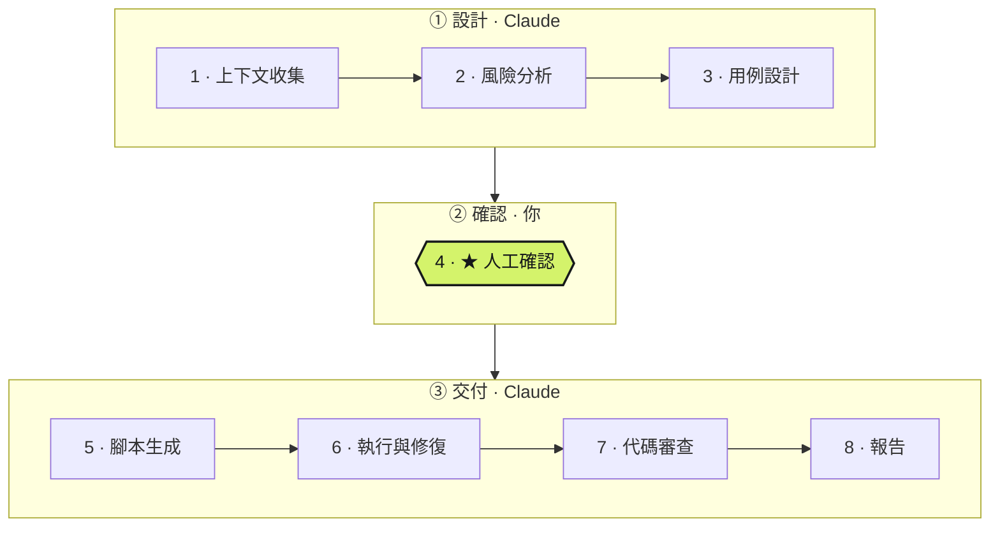
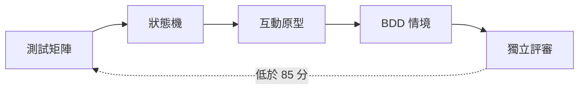

# qa-workflow

[English](README.md) | 繁體中文

**把功能交給 Claude，確認一次情境，拿到能不能發布的結論。**

`qa-workflow` 是一個 Claude Code plugin，負責一個功能的 QA 工作：讀懂變更、找出可能出錯的地方、寫成 BDD 情境、轉成自動化測試，最後告訴你這個功能能不能上線。

## 安裝

三種方式擇一：

**Claude Code plugin**（推薦）
```
/plugin marketplace add JulianWangHZ/QA-Workflow-Skills
/plugin install qa-workflow@qa-workflow
```

**npx**：安裝到任何讀得懂 `SKILL.md` 的 agent
```bash
npx -y skills add JulianWangHZ/QA-Workflow-Skills --skill '*' -g
```

**git clone**：離線使用或要自己修改
```bash
git clone https://github.com/JulianWangHZ/QA-Workflow-Skills.git
```
接著在 Claude Code 中執行 `/plugin marketplace add ./QA-Workflow-Skills`，再執行 `/plugin install qa-workflow@qa-workflow`。

8 個 skill 要一起安裝，它們共用 `skills/qa-workflow` 裡的 CLI。

## 快速上手

在要驗收的專案中，告訴 Claude 要檢查什麼：

```
QA 這張單：https://your-tracker/browse/SHOP-128
驗收 feature/checkout 分支的結帳流程
QA 新的密碼鎖定規則：連續輸錯 5 次會鎖定 15 分鐘
```

只有需要你的時候才會停下來：

| 什麼時候 | 你要做什麼 |
|---|---|
| 第一次使用 | 確認它偵測到的測試指令（`.qa/config.json`） |
| 缺少必要的 MCP 或裝置 | 設定好之後重新啟動 Claude Code，再說「繼續 QA」 |
| **★ 人工確認** | 打開審閱頁，確認情境，或提出要修改的地方 |

其他步驟都會自動完成，報告在 `.qa/reports/latest.html`。

| 之後想要… | 這樣說 |
|---|---|
| 接續中斷的流程 | 「繼續 QA」 |
| 修好之後重測 | 「重測上一次的 QA」 |
| 在上一次的基礎上追加情境 | 「追加…的情境」 |
| 查看進度 | 「QA 進度」 |

## 為什麼用它

- **你只需要做一次決定。** Claude 只會請你確認情境。確認後內容就會鎖定，測試一定和你同意的內容一致。
- **PM 也看得懂用例。** 情境會附上一個審閱頁，裡面有白話的驗收清單，以及能逐步示範每個情境的可點擊原型。
- **結論不是意見。** 通過、失敗、能不能上線，都是根據實際的測試結果計算出來，不是由模型自己寫的。

## 八個階段



| 階段 | 包含 | 誰負責 | 產出 |
|---|---|---|---|
| **① 設計** | 上下文收集 → 風險分析 → 用例設計 | Claude | 依 P0–P3 排序的風險、BDD 情境、審閱頁 |
| **② 確認** | ★ 人工確認 | **你** | 確認後的情境會被鎖定 |
| **③ 交付** | 腳本生成 → 執行與修復 → 代碼審查 → 報告 | Claude | 自動化測試、執行結果、審查意見、結論 |

每個階段都要通過檢查才能進入下一個。確認之後情境如果被修改，流程會退回 ②，等你重新確認。

## 情境怎麼設計

情境不是憑感覺寫的。第 3 階段會依序完成五個步驟，每一步都是下一步的依據：



| 步驟 | 做什麼 |
|---|---|
| **測試矩陣** | 把輸入類別、邊界、規則組合、角色、資料狀態整理成表格。每一列都要對應到情境，或寫明不測的理由 |
| **狀態機** | 列出所有狀態與轉換，包含系統必須**阻擋**的轉換。每條轉換都有情境，每條被阻擋的轉換也有 |
| **互動原型** | 做出可點擊的原型，能逐步示範每個情境：app 用 iPhone 外框，web 有桌面與手機兩種檢視 |
| **BDD 情境** | 寫成 Gherkin：宣告式、一個情境只驗一件事，tag 分為 `@regression`、`@smoke`、`@auto`、`@邊界` |
| **獨立評審** | 設計完成後另開一輪評審，重新讀取產物並依 100 分制評分，低於 85 分就退回修改 |

過程中會逐一判定 12 種測試設計技法：
- 等價類劃分
- 邊界值分析
- 決策表
- 正向、負向與例外路徑
- 狀態轉換
- 角色與權限
- 資料生命週期
- 成對組合
- 錯誤猜測
- 併發與重複操作
- 外部依賴失效
- 環境與設定差異

不適用的技法必須寫出理由，每個 P0、P1 風險都至少要有一個情境覆蓋。

## 測試怎麼產生

第 5 階段分成兩個角色，第 6 階段再加上第三個：

| 角色 | 做什麼 |
|---|---|
| **Planner** | 在真實的 app 上走過每個 `@auto` 情境：web 用 Playwright MCP，app 用 Appium MCP，沒設定好就停下來。它會記錄實際存在的 locator，以及每個 Then 可以用什麼來驗證，再把每個情境判定為「可自動化」「需要 API 建立資料」或「無法自動化」，並附上證據 |
| **Generator** | 依證據寫出 step definitions 與 Page Object，只能使用 planner 驗證過的 selector |
| **Healer** | 回到 app 中失敗的地方找原因，修正測試（每個測試最多修兩輪）。如果是 app 本身有問題就停手，不修改斷言 |

每個通過的測試還要做防假綠檢查：故意把一條關鍵斷言改壞，測試必須因此失敗。無法自動化的情境不會卡住流程，會連同原因列在報告中，標為需要人工驗證。

## 開始之前

| 需要 | 用途 |
|---|---|
| Node.js 20+ | 執行流程的 CLI（沒有其他依賴） |
| web 產品需要 **Playwright MCP**，app 需要 **Appium MCP** | planner 與 healer 在真實的 app 上操作，不用猜的 |
| 可以連線的測試網址，或已開啟並安裝好 app 的模擬器／實機 | 讓 planner 能走過每個情境 |
| 專案本身的測試工具 | 執行產生的測試（見下表） |

支援的自動化框架會自動偵測，同一個 repo 也可以混用（例如 web 與 app）：

| 語言 | 框架 | 平台 |
|---|---|---|
| TypeScript | Playwright + playwright-bdd 或 cucumber-js | Web |
| TypeScript | WebdriverIO + Appium（+ cucumber） | iOS／Android |
| Python | pytest-bdd 或 behave，驅動 Playwright、Selenium 或 Appium | Web／iOS／Android |
| Python | 純 pytest（不用 BDD），驅動 Playwright、Selenium 或 Appium | Web／iOS／Android |

每種框架都有自己的 coding style 範例。產生的測試會優先沿用專案既有的慣例。

MCP 可以設定在專案（`.mcp.json`）、你自己的 Claude Code 設定，或以 plugin 安裝。例如：

```
claude mcp add playwright -- npx @playwright/mcp@latest
```

缺少必要的 MCP 時，流程會在寫任何測試之前停下來，並告訴你要設定什麼。設定好之後重新啟動 Claude Code，再說「繼續 QA」。locator 絕不用猜的，所以不會跑到後面才失敗、又要重來。

## 延伸閱讀

- [設定](skills/qa-workflow/references/config.md)
- [情境與 tag 的寫法](skills/qa-cases/references/gherkin.md)
- [產生測試的 coding style](skills/qa-scripts/references/coding-style.md)
- [架構](docs/architecture.md)

---

以 [MIT License](LICENSE) 授權。
